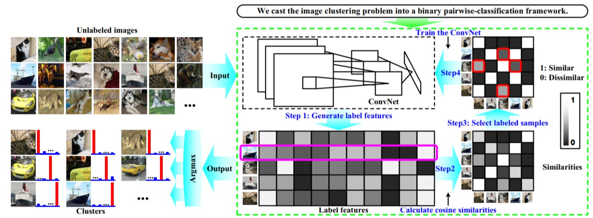

Deep Adaptive Image Clustering
---



### Paper Summarize

**DAC(Deep Adaptive Image Clustering) is Unsupervisor Learning that use Adaptive Deep Learning Algorithm**

1. Each Images(Train Set & Test Set) labels of features is generated by ConvNet(7 Convloutions Layer and 2 Fully-Connected Layer)

   ```python
   def ConvNetwork(in_img, num_cluster, name='ConvNetwork', reuse=False):
       ...
   	return out
   ```

2. This Label features is calculated by cosine similarities

   ```python
   label_feat = ConvNetwork(image_pool_input, num_cluster, name='ConvNetwork', reuse=False)
   label_feat_norm = tf.nn.l2_normalize(label_feat, dim=1)
   sim_mat = tf.matmul(label_feat_norm, label_feat_norm, transpose_b=True)
   ```

3. Adaptive Algorithm can Optimize Which Images is more similar using this Cost Function

   ```python
   pos_loc = tf.greater(sim_mat, u_thres, name='greater')
   neg_loc = tf.less(sim_mat, l_thres, name='less')
   pos_loc_mask = tf.cast(pos_loc, dtype=tf.float32)
   neg_loc_mask = tf.cast(neg_loc, dtype=tf.float32)
   
   pred_label = tf.argmax(label_feat, axis=1)
   
   # Deep Adaptive Image Clustering Cost Function Optimize
   pos_entropy = tf.multiply(-tf.log(tf.clip_by_value(sim_mat, eps, 1.0)), pos_loc_mask)
   neg_entropy = tf.multiply(-tf.log(tf.clip_by_value(1-sim_mat, eps, 1.0)), neg_loc_mask)
   
   loss_sum = tf.reduce_mean(pos_entropy) + tf.reduce_mean(neg_entropy)
   train_op = tf.train.RMSPropOptimizer(lr).minimize(loss_sum)
   ```

4. This Algorithm runs Until u > l confidence is right


## Usage

- MNIST : You can run MNIST DAC on [This Google Colab](https://colab.research.google.com/drive/1OdoFwOnVvpR1jhlLweqM90pltyQYjeLm)


#### Common Images

Folder Structure Example

```
+-- train
|   12345678_000001.jpg
|   12345678_000002.jpg
|   1111111_000001.jpg
|   1111111_000002.jpg
+-- test
|   12345678_000003.jpg
|   12345678_000004.jpg
|   1111111_000003.jpg
```

File name `12345678_000001.jpg` The front of `_` means label of image and back is image's ID.


Parameter Setting

```python
mode = 'Training'
num_cluster = 153
eps = 1e-10
height = 300
width = 300
channel = 3
```


## Reference

- [The original ICCV paper](http://openaccess.thecvf.com/content_ICCV_2017/papers/Chang_Deep_Adaptive_Image_ICCV_2017_paper.pdf)
- [Deep Adaptive Image Clustering Youtube](https://www.youtube.com/watch?v=03sq7GPHc6E)
- [Author implementation in Keras](https://github.com/vector-1127/DAC)
- [DAC-tensorflow(MNIST)](https://github.com/HongtaoYang/DAC-tensorflow)